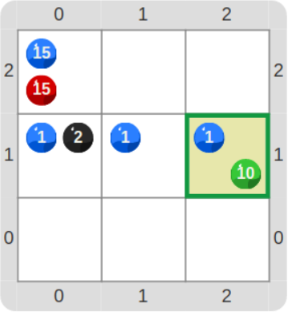

# TP Paradigma Funcional

El link a la consigna lo encontrarán [aqui](https://docs.google.com/document/d/1VP5v_2NjlYbjotHGusCb1tOyrxt559C4pvYDpQk1oQs/edit)

Gobstones es un Lenguaje de programación desarrollado por la Universidad de Quilmes. Este lenguaje es usado por los docentes de la universidad para enseñar los primeros pasos en la programación.

Su primera versión fue desarrollada en Haskell y vamos a replicarla para que puedan enseñarles a programar a quienes ustedes quieran con un programa hecho por ustedes.

El lenguaje **Gobstones** es muy simple y consta de poquitas estructuras básicas:

- **Tablero**: Es el elemento principal del lenguaje. Tiene una cantidad de filas y de columnas que representan una matriz de **celdas**.
- **Cabeza**l: Este siempre se encuentra en una celda del tablero, a la que llamaremos celda actual:
    - Puede moverse de a una celda hacia una **dirección** (norte, sur, este u oeste).
    - Donde se encuentre puede realizar solo dos acciones:
        - Poner una bolita de un color.
        - Sacar una bolita de un color.
- Las **bolitas** pueden ser de alguno de estos colores: rojo, azul, verde o negro.

Se pide, en el lenguaje Haskell:

**1.** Modelar las estructuras básicas del lenguaje:

1. **El tablero.**
2. **El cabezal.**
3. **Las celdas.**
4. **Las bolitas.**
5. **Las direcciones o puntos cardinales.**

**2.** Realizar una función para **inicializar** un **tablero** que reciba un tamaño y devuelva un tablero vacío (es decir que cada una de sus celdas no tenga bolitas) de dicho tamaño con el cabezal en la celda (1, 1).

**3.** Codificar las sentencias primitivas del lenguaje Gobstones:

1. **Mover el cabezal de un tablero una posición hacia un punto cardinal. Esto devuelve un nuevo tablero con el cabezal movido una posición en dicha dirección. Si el cabezal se cayera del tablero debería fallar con la leyenda “El cabezal se cayó del tablero”.**
2. **Poner: que recibe una bolita de un color, un tablero y devuelve un nuevo tablero con la bolita puesta en el la celda actual. Llamaremos celda actual a la celda que está en la misma posición que el cabezal del tablero.**
3. **Sacar: que recibe una bolita de un color, un tablero y devuelve un nuevo tablero con una bolita menos de ese color en la celda actual. Si no hay ninguna bolita de ese color en la celda actual debería fallar con la leyenda “No hay bolitas del color {color} para sacar de la celda actual”.**

**4.** Codificar sentencias compuestas, tales como:

1. **Repetir una determinada cantidad de veces un conjunto de sentencias sobre un tablero dado.**
2. **Alternativa. Esta viene en 3 sabores distintos:**
    1. La sentencia **alternativa:** recibe una condición que se aplica sobre un tablero y dos conjuntos de sentencias y un tablero. Si la condición aplicada al tablero es verdadera ejecuta sobre el tablero el primer conjunto de sentencias. Si es es falsa ejecuta el segundo grupo de sentencias.
    2. La sentencia **si:** recibe una condición que se aplica a un tablero, un grupo de sentencias, un tablero y ejecuta las sentencias sobre el tablero si la condición sobre este es verdadera.
    3. La sentencia **si no:** recibe una condición que se aplica a un tablero, un grupo de sentencias, un tablero y ejecuta las sentencias sobre el tablero si la condición sobre este es falsa.
3. **Mientras: dada una condición, un conjunto de sentencias y un tablero, repite indeterminadamente las sentencias sobre el tablero mientras la condición sobre este se cumpla.**
4. **Ir al borde: que dada una dirección y un tablero, se mueve en esa dirección mientras pueda hacerlo.**

**5.** Codificar las siguientes expresiones para saber si:

1. **Puede moverse el cabezal: que dada una dirección y un tablero nos dice si mover el cabezal del tablero en esa dirección no provoca que este se caiga del mismo.**
2. **Hay bolita de un color dado: nos retorna si hay alguna bolita de cierto color en la celda actual.**
3. **Cantidad de bolitas: nos retorna la cantidad de bolitas de un color dado que se encuentran en la celda actual del tablero.**

**6.** Codificar la instrucción **programa**, que recibe un tablero y una lista de sentencias y retorna el tablero resultante de aplicar todas las sentencias sucesivamente sobre este.


**7.** Escribir este programa de gobstones en haskell,  partiendo de un tablero vacío de tres por tres.

``` c
program {
	Mover(Norte)
	Poner(Negro)
	Poner(Negro)
	Poner(Azul)
	Mover(Norte)
	repeat(15){
		Poner(Rojo)
		Poner(Azul)
	}
	if(hayBolitas(Verde)){
		Mover(Este)
		Poner(Negro)
	}else{
		Mover(Sur)
		Mover(Este)
		Poner(Azul)
	}
	Mover(Este)
	while(nroBolitas(Verde) <= 9){
		Poner(Verde)
	}
	Poner(Azul)
}
```
El resultado de aplicar ese algoritmo es un tablero como este: 
<div align="center">


